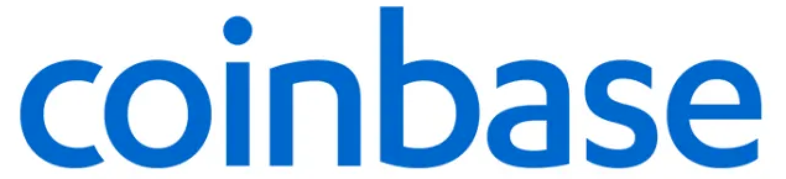

# FinTech Case Study - Akanksha Srivastava

---
## ***Links:***
* [CNBC - Founders](https://www.cnbc.com/2021/04/14/coinbase-co-founders-launched-when-a-bitcoin-btc-was-worth-6.html)
* [Crunchbase - Funding](https://www.crunchbase.com/organization/coinbase/company_financials)
* [Blockchain Stats](https://explodingtopics.com/blog/blockchain-stats)
* [Kings of Crypto](https://www.google.com/books/edition/_/0vDcDwAAQBAJ?hl=en&gbpv=1&pg=PT9&dq=Brian+armstrong+and+Fred+Ehrsam)
* [Coinbase Tech Stack](https://surf.dev/coinbase-tech-stack-technologies-that-power-the-cryptocurrency-platform/)
---
## Overview and Origin

* **Name of company**
    *  Coinbase Inc.    
* **When was the company incorporated?**
    *  2012 
* **Who are the founders of the company?**  
    *  Brian Armstrong and Fred Ehrsam 
* **How did the idea for the company (or project) come about?**  
    >  Armstrong and Ehrsam first met on Reddit and shared a bullish view on bitcoin and the cryptocurrency space as a whole, Ehrsam said on Twitter. In turn, they decided to launch Coinbase with the “mission” to “make crypto easy to use.”Although the company currently has a multibillion-dollar valuation, its beginnings were “not glamorous,” Ehrsam said. “Coinbase launched out of a two bedroom apartment we shared with another company.” 

* **How is the company funded? How much funding have they received?**
    * $547.3M

## Business Activities:

* **What specific financial problem is the company or project trying to solve?**
    *  Brian's idea was to provide a service where you could own Bitcoin without controlling a private key. Coinbase would do it for you 

* **Who is the company's intended customer? Is there any information about the market size of this set of customers? What solution does this company offer that their competitors do not or cannot offer? (What is the unfair advantage they utilize)**
    * As of 2021, about 106 million people around the world use cryptocurrencies
    * About 46 million Americans (roughly 22% of the adult population) own a share of Bitcoin.
    * By 2025, financial analysts say, the global blockchain market will grow by $39.17 billion U.S. dollars.
* **Which technologies are they currently using, and how are they implementing them? (This may take a little bit of sleuthing–– you may want to search the company’s engineering blog or use sites like Stackshare to find this information.)** 
    * React Native for Coinbase applications
    * Web 3.0 for Coinbase Wallet
    * AWS as Coinbase cloud solution
    * Coinbase API for integrations 

## Landscape:

* **What domain of the financial industry is the company in?**
    * 
* **What have been the major trends and innovations of this domain over the last 5-10 years?**

* **What are the other major companies in this domain?**

## Results

* **What has been the business impact of this company so far?**

* **What are some of the core metrics that companies in this domain use to measure success? How is your company performing, based on these metrics?**

* **How is your company performing relative to competitors in the same domain?**

## Recommendations

* **If you were to advise the company, what products or services would you suggest they offer? (This could be something that a competitor offers, or use your imagination!)**

* **Why do you think that offering this product or service would benefit the company?**

* **What technologies would this additional product or service utilize?**

* **Why are these technologies appropriate for your solution?**