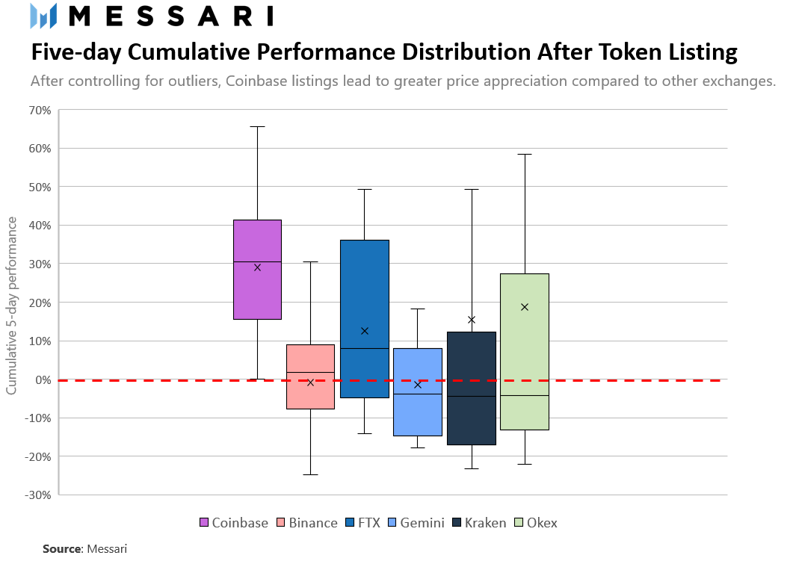

# FinTech Case Study - Akanksha Srivastava

---
---
## Overview and Origin

* **Name of company**
    *  Coinbase Inc.    
* **When was the company incorporated?**
    *  2012 
* **Who are the founders of the company?**  
    *  Brian Armstrong and Fred Ehrsam 
* **How did the idea for the company (or project) come about?**  
    >  Armstrong and Ehrsam first met on Reddit and shared a bullish view on bitcoin and the cryptocurrency space as a whole, Ehrsam said on Twitter. In turn, they decided to launch Coinbase with the “mission” to “make crypto easy to use.”Although the company currently has a multibillion-dollar valuation, its beginnings were “not glamorous,” Ehrsam said. “Coinbase launched out of a two bedroom apartment we shared with another company.” 

* **How is the company funded? How much funding have they received?**
    * $547.3M

## Business Activities:

* **What specific financial problem is the company or project trying to solve?**
    *  Brian's idea was to provide a service where you could own Bitcoin without controlling a private key. Coinbase would do it for you 

* **Who is the company's intended customer? Is there any information about the market size of this set of customers? What solution does this company offer that their competitors do not or cannot offer? (What is the unfair advantage they utilize)**
    * As of 2021, about 106 million people around the world use cryptocurrencies
    * About 46 million Americans (roughly 22% of the adult population) own a share of Bitcoin.
    * By 2025, financial analysts say, the global blockchain market will grow by $39.17 billion U.S. dollars.
* **Which technologies are they currently using, and how are they implementing them? (This may take a little bit of sleuthing–– you may want to search the company’s engineering blog or use sites like Stackshare to find this information.)** 
    * React Native for Coinbase applications
    * Web 3.0 for Coinbase Wallet
    * AWS as Coinbase cloud solution
    * Coinbase API for integrations 

## Landscape:

* **What domain of the financial industry is the company in?**
    * Coinbase is in the Blockchain and Cryptocurrencies Domain. When Brian Armstrong was asked by an employee of Coinbase whether they are a tech company or a finance company, he said if we were forced to label ourselves as one of the two we would be a tech company first; But ultimately we are neither one. We are something different and new: a crypto company. 

* **What have been the major trends and innovations of this domain over the last 5-10 years?**
    * In 2017, the cryptocurrency industry saw record-breaking growth rates in the number of market participants and market capitalization
    * ICOs- Initial Coin Offerings (ICO) are financial transactions used to raise funds for a new cryptocurrency or other digital asset. Investors pay using cash or another cryptocurrency and are given a percentage of the new cryptocurrency in return 
    * Blockchain has taken the technology world by storm with the rise of Bitcoin. 
    * One of the major drivers of the growth seen in the crypto market has simply been a large increase in investor appetite
    * Because of the new technologies that it employs and its applications in the several industries, cryptocurrencies are expected to continue to grow and eventually stabilize. 
    * Volatility will gradually subside over the coming decade as more regulation, a greater diversity of investors, and improved security measures enter the market. Because of this, there will be a continued flow of capital into the crypto market as long term investors begin to invest and build a solid foundation for long term market growth.

* **What are the other major companies in this domain?**
    * Voyager
        * A popular platform to invest in crypto as it was one of the first publicly traded exchanges. They are app-driven and offer a commission-free trading structure. 
    * BlockFi
        * A cryptocurrency investment platform that allows you to lend and earn interest on your holdings. Also, instead of selling your coins and tokens, you can also borrow against your holdings.
    * Uphold 
        * Offers simple solution to trading multiple assets — open one account and trade multiple assets without making a trip back to cash. If you've every traded crypto, you'll know a lot of coins and tokens only trade in certain pairs, so you're always going back to BTC or ETH. But on Uphold, you can trade multiple assets directly.
    * Kraken
        * One of the original crypto trading platforms and they have a good selection of coins and tokens to trade and invest in. They also allow margin trading. However, it's a real exchange, and not as easy to use as some of the top platforms on this list. 
    * eToro
        * Has been around for a while in the UK and throughout Europe, but they are now allowing traders in the United States. They offer a huge variety of digital assets to buy and sell on their platform, and even better, they have a practice trading account so you can give it a try before you actually use real funds
    * Bitcoin IRA
        * Unlike most exchanges and wallets, you're basically just exchanging currency and are subject to paying taxes on your gains. With that being said, Bitcoin IRA combines the best of being a crypto wallet and exchange, with also being an IRA. That means that your gains inside the account are tax free or tax deferred.  
    * Crypto.com
        * One of the largest and fastest growing crypto exchanges. It's based in Hong Kong, but offers a ton of support for US-based customers.
    * Binance
        * A great platform for getting into some currencies like Cardano or Neo. Not as easy to use.
    * Hodlnaut
        * Hodlnaut is a savings and lending platform that focuses on Bitcoin and several stablecoins.

## Results

* **What has been the business impact of this company so far?**
    * The "Coinbase Effect” has turned into a phenomenon around the industry whereby a listing will positively affect a token or coin. The theory around the ‘Coinbase Effect’ is simple: get listed on Coinbase, and your price will skyrocket. 
    * The effects of the Coinbase listing are indeed short-lived, however predictable.
    * 
 
* **What are some of the core metrics that companies in this domain use to measure success? How is your company performing, based on these metrics?**
    * Core Metrics for CoinBase:
        * User metrics
        * Security
        * Regulatory compliance
        * Ease-of-use

* **How is your company performing relative to competitors in the same domain?**
    *  8.8M users who transacted monthly on its platform, up from 1.5M a year earlier. Coinbase has 68M verified users and over $180B in cryptoassets on its platform.

    *  Coinbase raked in over $2B in revenue in the quarter ended June 30, 2021, and a net profit of $1.6B.
    * Majority of cryptoassets stored offline in cold storage vaults, and the remainder insured by Lloyd’s of London. Funds held in USD wallets on Coinbase are covered by the FDIC and insured up to $250,000.
    * Coinbase has made a point of complying with state-by-state money transmission laws, and is one of a few companies to hold a New York Virtual Currency License, or “BitLicense.” 

## Recommendations

* **If you were to advise the company, what products or services would you suggest they offer? (This could be something that a competitor offers, or use your imagination!)**
    *  I would advise Coinbase to have better Customer support options. Coinbase struggles in the customer support category and even though they have Coinbase Earn that lets you “earn while you learn” through a series of video classes and exams, some customer needs can be urgent. I feel that as a customer knowing that someone is there is chat or talk to especially when it comes to money is very valuable.

* **Why do you think that offering this product or service would benefit the company?**
    * This would benefit the company because people would be more comfortable investing when they can talk to someone about any concerns they might have. and if there is a fundementally complex issue they can be re-directed to a specific lesson/ video that would help. 

* **What technologies would this additional product or service utilize?**
    * There are many different ways to implement either a chat agent on the website directly or even have 24-hr phone call service.

* **Why are these technologies appropriate for your solution?**
    *  They are simple to implement and use for both the customer and the representative, just needs people to actually be on the other side to communicate.
---
## ***Links to Resources:***
* [Kings of Crypto](https://www.google.com/books/edition/_/0vDcDwAAQBAJ?hl=en&gbpv=1&pg=PT9&dq=Brian+armstrong+and+Fred+Ehrsam)
* [CNBC - Founders](https://www.cnbc.com/2021/04/14/coinbase-co-founders-launched-when-a-bitcoin-btc-was-worth-6.html)
* [Crunchbase - Funding](https://www.crunchbase.com/organization/coinbase/company_financials)
* [Blockchain Stats](https://explodingtopics.com/blog/blockchain-stats)
* [Coinbase Tech Stack](https://surf.dev/coinbase-tech-stack-technologies-that-power-the-cryptocurrency-platform/)
* [Coinbase Blog](https://blog.coinbase.com/is-coinbase-a-finance-or-tech-company-f474b852272d)
* [Crypto Growth](https://investmentbank.com/crypto-growth/)
* [Top Crypto Companies](https://thecollegeinvestor.com/21245/top-10-bitcoin-crypto-investing-sites/)
* [Coinbase Effect](https://www.bsc.news/post/cryptonomics-what-is-the-coinbase-effect#:~:text=This%20%E2%80%9CCoinbase%20Effect%E2%80%9D%20has%20turned,and%20your%20price%20will%20skyrocket.)
* [Growth Metrics](https://www.cbinsights.com/research/report/coinbase-strategy-teardown/#kingmaker)
* [Coinbase at a Glance](https://www.nerdwallet.com/reviews/investing/brokers/coinbase)