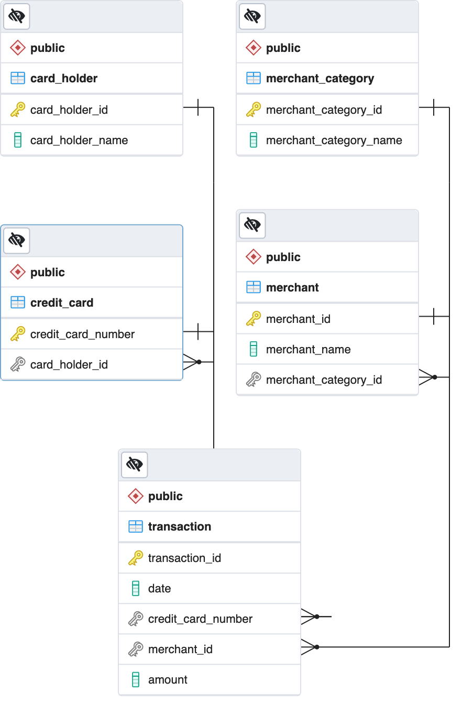
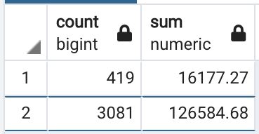

# Unit 7 Homework Assignment: Looking for Suspicious Transactions

In this homework assignment, I applied SQL skills to analyze historical credit card transactions and consumption patterns in order to identify possible fraudulent transactions.

This was done in three parts:
* **1. Data Modeling** 
    * I created the **ERD Diagram** shown below:
    * 
* **2. Data Engineering**
    * I created tables according the the ERD Diagram and set up the following foreign keys:
        * **fk_card_holder_id:**
            - credit_card.card_holder_id referencing card_holder.card_holder_id
        * **fk_category_id:**
            - merchant.merchant_category_id referencing merchant_category.merchant_category_id
        * **fk_credit_card_number:**
            - transaction.credit_card_number referencing credit_card.credit_card_number 
        * **fk_merchant_id:**
            - transaction.merchant_id referencing merchant.merchant_id
---
* **3.Data Analysis**
    * Part 1: Some fraudsters hack a credit card by making several small transactions (generally less than $2.00), which are typically ignored by cardholders. 
        * I isolated the total number of transactions of each card holder. Crystal Clark had the most transactions at 221 transactions, and Elizabeth Sawyer had the least at 58 transactions. The entire list of holders and their total transactions can be found in [Total_trans_per_holder.csv](Starter_Files/Query_Results/Total_trans_per_holder.csv)

            - Query Used:
                > **SELECT** card_holder_name, COUNT(transaction_id)as number_of_trans_per_holder  
                  **FROM** transaction t  
                  **INNER JOIN** credit_card cc ON t.credit_card_number = cc.credit_card_number  
                  **INNER JOIN** card_holder c ON cc.card_holder_id = c.card_holder_id  
                  **GROUP BY** card_holder_name  
                  **ORDER BY** number_of_trans_per_holder DESC;  

        * Then, I counted the transactions that are less than $2.00 per cardholder. Megan Price had the most transactions less then $2.00 at 26 transactions, followed by Brandon Pineda, Stephanie Dalton, and Peter Mckay each at 22 transactions. The entire list can be found in [Trans_less_than_2.csv](Starter_Files/Query_Results/Trans_less_than_2.csv)
            - Query Used:
                > **SELECT** card_holder_name, COUNT(t.transaction_id) as trans_count  
                  **FROM** transaction t  
                  **INNER JOIN** credit_card cc ON t.credit_card_number = cc.credit_card_number  
                  **INNER JOIN** card_holder c ON cc.card_holder_id = c.card_holder_id  
                  **WHERE** amount <= 2.00  
                  **GROUP BY** card_holder_name  
                  **ORDER BY** trans_count DESC;  
        * There could be evidence to suggest that Megan Price's credit card has been hacked because she has 26 transactions over the course of a year that are less than $2.00. If I assume that anything above 20 transactions could be fraudulent, then Brandon Pineda's, Stephanie Dalton's, and Peter Mckay's cards could have been hacked. Further investigation will clarify if these assumptions are accurate. 

        * I took my investigation a step futher by considering the time period in which potentially fraudulent transactions are made. I looked at the top 100 highest transactions made between 7:00 am and 9:00 am. The largest transactions that I thought looked suspicious were $1894, $1617, $1334, $1301 and $1131. The entire list can be found in [top_100_7_9.csv](Starter_Files/Query_Results/top_100_7_9.csv)
            - Query Used:
                > **SELECT** transaction_id, amount  
                  **FROM** transaction 
                  **WHERE** date_part('hour',date) BETWEEN 7 AND 9 
                  **ORDER** BY amount DESC 
                  **limit** 100; 
        * I also checked if there was a higher number of fraudulent transactions made during between 7:00 am and 9:00 am versus the rest of the day. However, there were more number of transactionas and a higher amount during the other times of the day. In the table below, the first row shows the number of transactions and the sum of the amount of transactions between 7-9AM, and the next row shows all the other times.
            - 
            - Query Used:
                > (**SELECT** COUNT(transaction_id), SUM(amount)  
                   **FROM** transaction 
                   **WHERE** date_part('hour',date) **BETWEEN** 7 AND 9) 
                   **UNION ALL** 
                  (**SELECT** COUNT(transaction_id), SUM (amount) 
                   **FROM** transaction 
                   **WHERE** date_part('hour',date) **NOT BETWEEN** 7 AND 9); 
        * Next, I found the top 5 merchants prone to being hacked using small transactions:
            1. Wood-Ramirez
            2. Hood-Phillips
            3. Baker Inc
            4. Mcdaniel, Hines and Mcfarland
            5. Hamilton-Mcfarland
            - Query Used:
                > **SELECT** merchant_name, COUNT(t.transaction_id) as trans_count 
                  **FROM** transaction t 
                  **INNER** JOIN merchant m ON t.merchant_id = m.merchant_id 
                  **WHERE** amount <= 2.00 
                  **GROUP** BY merchant_name 
                  **ORDER** BY trans_count DESC  
                  **LIMIT** 5; 
        * I adjusted all the queries by creating views for each of the results. The file with all the queries i wrote can be found in [queries.sql](Starter_Files/Query_Results/queries.sql)
    * Part 2: [Starter_Files/visual_data_analysis.ipynb](Starter_Files/visual_data_analysis.ipynb)