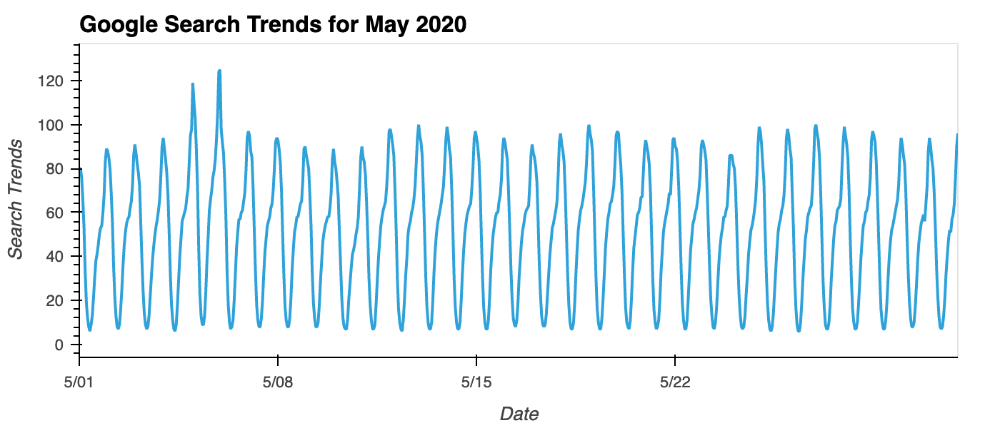
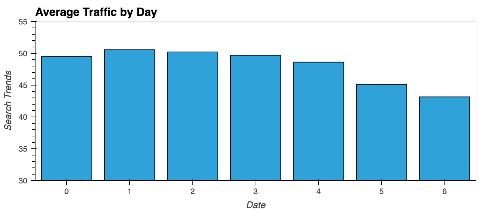
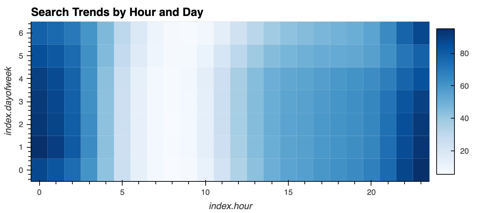
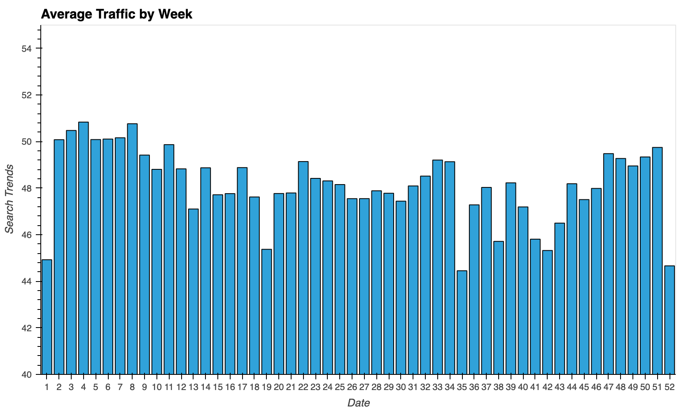
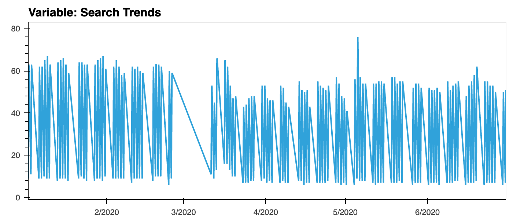
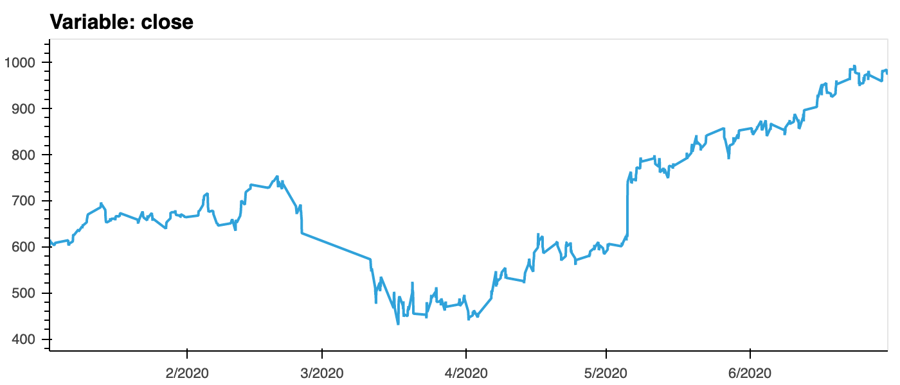
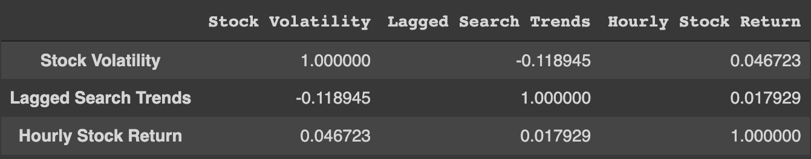
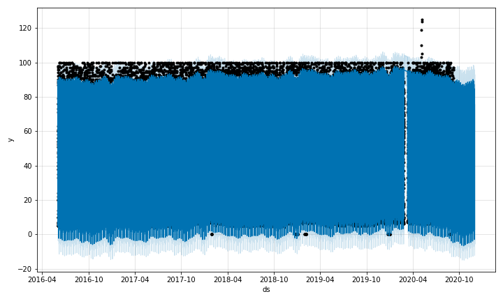
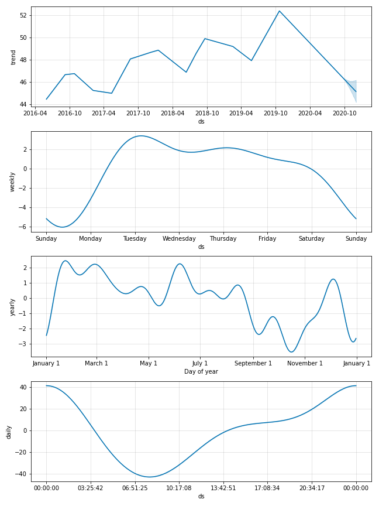
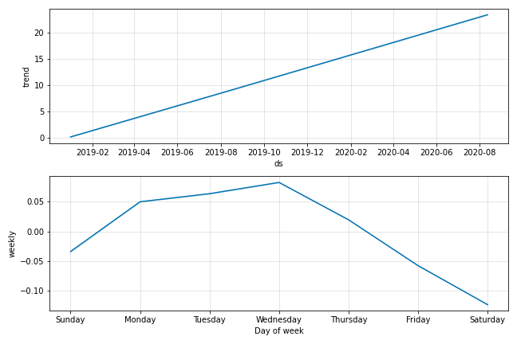

# Forecasting Net Prophet
MercadoLibre is the most popular e-commerce site in Latin America. As a growth Analyst, I've been tasked with analyzing the company's financial and user data in clever ways to help the company grow. So, I want to find out if the ability to predict search traffic can translate into the ability to successfully trade the stock. To do so, I created a Jupyter notebook that can be found in: : [Starter_Code/forecasting_net_prophet.ipynb](Starter_Code/forecasting_net_prophet.ipynb).

## Step 1: Find Unusual Patterns in Hourly Google Search Traffic
The data science manager asks if the Google search traffic for the company links to any financial events at the company. Or, does the search traffic data just present random noise? To answer this question, I connected the Google search data for the company to the corporate financial events to see if there are nay unusual patterns. Specifically, I looked at May 2020 when MercadoLibre released its quarterly financial results.  
First, I plotted the Google Search trends for May 2020  
 
Then I calculated the total search traffic for May 2020 (which was 38181) and compared it to the monthly median across all months (which equals 35172.5). ***Therefore, there was an increase of 3008.5 searches in May 2020.***  

## Step 2: Mine the Search Traffic Data for Seasonality
Marketing realizes that they can use the hourly search data, too. If they can track and predict interest in the company and its platform for any time of day, they can focus their marketing efforts around the times that have the most traffic. This will get a greater return on investment (ROI) from their marketing budget. To that end, I mined the search traffic data for predictable seasonal patterns of interest in the company.  
To do so, first I plotted the average traffic by the day of week 
 
Then, I visualized the data as a heatmap to be able to decide that: ***there seems to be more concentrated number on On Day 1 of the week, at hour 0 and Day 0 at hour 24. Then on Days 2-4 there is also a higher number at hour 0. Also, Day 1 and 2 at hour 24.***   
 
I also grouped and plotted the data the average traffic by the week of the year to see if the search traffic tends to increase during the winter holiday period (weeks 40 through 52). ***Looking at the graph, it looks like the traffic dips down and slowly increases. But the highest traffic is towards the beginning of the year (weeks 2-8)***
 

## Step 3: Relate the Search Traffic to Stock Price Patterns
The finance group at the company also wants to know if any relationship exists between the search data and the company stock price. To determine if there is, I plotted both data sets to determine that ***in both time series there is a major dip in March, but there doesnt seem to be a similar increase in search trends as there is in the close price.***
  
  
To determine if there is a predictable relationship between the lagged search traffic and the stock volatility or between the lagged search traffic and the stock price returns, I first calculated the Stock Volatility using the standard deviation of the closing stock price return data over a 4 period rolling window. I also got the Hourly Stock Return by calculating the hourly return percentage of the closing price. Then I created a correlation matrix:
  
***Since these correlation numbers are so low, I don't think a predictable relationship exists between them.***  

## Step 4: Create a Time Series Model with Prophet
I then used a Prophet forecasting model that analyzes and forecasts patterns in the hourly search data. The resulting forecasts plot: 
  
***So this shows, in near-term forecast, there is a steady decline and then slight rise at the end for the popularity of MercadoLibre***  

After visualizing the forecast results, I was able to determine:  
    - ***The time of day that exhibits the greatest popularity is Midnight***  
    - ***The day of the week that gets the most search traffic is Tuesday***  
    - ***The lowest point for search traffic in the calendar year is towards the end of September.***  
  

## Step 5 (Optional): Forecast Revenue by Using Time Series Models
The finance group wants a forecast of the total sales for the next quarter. First I used another Prophet forecasting model and analyzed the results to determine ***the peak revenue days are Mondays and Wednesdays, with Wednesday being the highest.***  
   
Then, using yhat as the Most Likely total sales for the next quarter, yhat_upper as the Best Case, and yhat_lower as the Worst Case, I was able to sum up the predictions for the quarter to determine:  
    - ***Most Likely: 969.577023***  
    - ***Best Case: 1051.120123***  
    - ***Worst Case: 887.214402***  