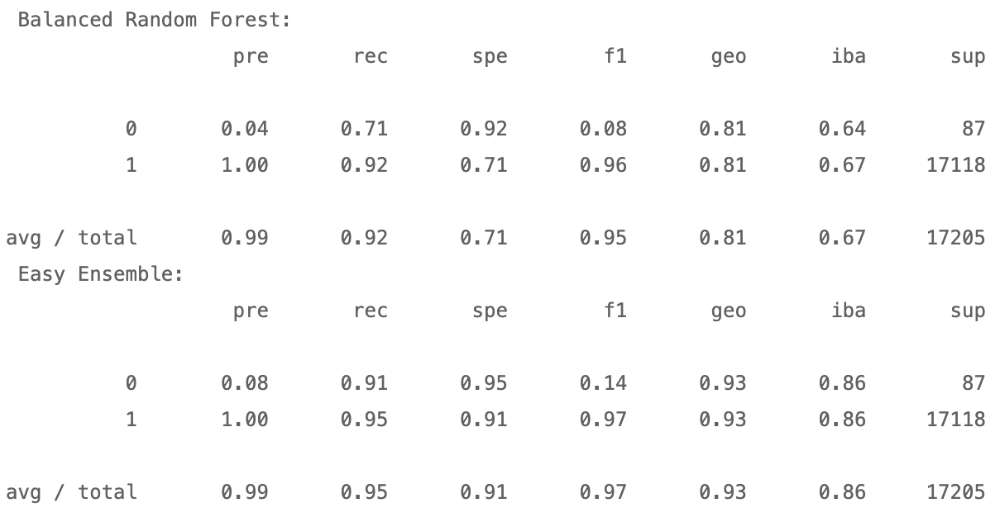

# Unit 11 - Risky Business Homework
Peer-to-peer lending services such as Loans Canada and Mogo let investors loan people money without using a bank. However, because investors always want to mitigate risk, a client has asked that I help them predict credit risk with machine learning techniques.

To do this I built and evaluated several machine learning models to predict credit risk using data from peer-to-peer lending services. Credit risk is an inherently imbalanced classification problem (the number of good loans is much larger than the number of at-risk loans), so I employed different techniques for training and evaluating models with imbalanced classes. I used the imbalanced-learn and Scikit-learn libraries to build and evaluate models Using Resampling and Ensemble Learning.

## Files
[Resampling Starter Notebook](Starter_Code/credit_risk_resampling.ipynb)
[Ensemble Starter Notebook](Starter_Code/credit_risk_ensemble.ipynb)

### Resampling
First I split the data into Training and Testing sets and then scaled them using the `StandardScaler` from `sklearn.preprocessing`. Then, I fit the data on a `logistic regression classifier` and calculated the `balanced accuracy score`, `confusion matrix` and `imbalanced classification report`. 
The resampling techniques I used were:
- Oversample the data using the `Naive Random Oversampler` and `SMOTE` algorithms.
- Undersample the data using the `Cluster Centroids` algorithm.
- Over- and undersample using a combination `SMOTEENN` algorithm. 
Comparing the above models, I was able to conclude:
- **The Random Oversampler model had the best balanced accuracy score at 0.9934649587814939 and it also had the highest recall and geo score**

### Ensemble Learning
The two ensemble learning models I used were Balanced Random Forest Classifier and and the Easy Ensemble Classifier. After splitting and scaling the data, I trained the data on each model and got the `balanced accuracy score`, `confusion matrix` and `imbalanced classification report`. 

Comparing the above models, I was able to conclude:
- **The Easy Ensemble model had the best balanced accuracy score at 0.9266541370044035**
- **Easy Ensemble had the best recall score**
- **Easy Ensemble had the best geometric mean score**
- **The Top 3 importances:total_rec_prncp, total_rec_int, total_pymnt_inv**