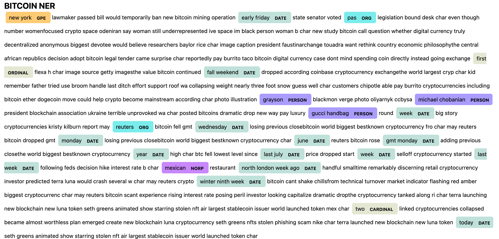
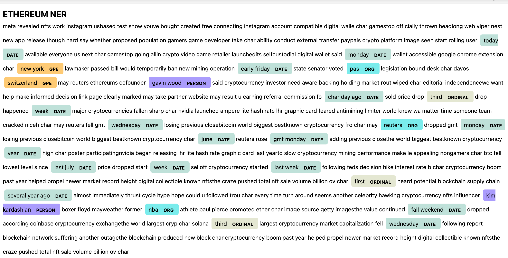

# Unit 12—Tales from the Crypto

## Files
[Starter Notebook](Starter_Code/crypto_sentiment.ipynb)

## Background
There's been a lot of hype in the news lately about cryptocurrency, so I want to take stock, so to speak, of the latest news headlines regarding Bitcoin and Ethereum to get a better feel for the current public sentiment around each coin.

In this assignment, I applied natural language processing to understand the sentiment in the latest news articles featuring Bitcoin and Ethereum. I also used fundamental NLP techniques to better understand the other factors involved with the coin prices such as common words and phrases and organizations and entities mentioned in the articles.

1. Sentiment Analysis
2. Natural Language Processing
3. Named Entity Recognition

### Sentiment Analysis
I used the [newsapi](https://newsapi.org/) to pull the latest news articles for Bitcoin and Ethereum and created a DataFrame of sentiment scores for each coin.

Using descriptive statistics I was able to determine that:
* Bitcoin had the highest mean positive score 0.0482.
    - Mean Positive Scores: {'Bitcoin': 0.0482, 'Ethereum': 0.04134999999999999} 
* Ethereum had the highest compound score 0.6908
    - Max Compound Scores: {'Bitcoin': 0.5267, 'Ethereum': 0.6908} 
* Ethereum had the highest max positive score 0.178
    - Max Positive Scores: {'Bitcoin': 0.164, 'Ethereum': 0.178} 

### Natural Language Processing
Then, I used NLTK and Python to tokenize text, find n-gram counts, and create word clouds for both coins. 
* Top 10 words for Bitcoin:
    1. ('char', 19)
    2. ('bitcoin', 11)
    3. ('new', 9)
    4. ('cryptocurrency', 8)
    5. ('world', 6)
    6. ('biggest', 5)
    7. ('week', 5)
    8. ('reuters', 5)
    9. ('blockchain', 4)
    10. ('may', 4)
* Top 10 words for Ethereum:
    1. ('char', 20),
    2. ('cryptocurrency', 11),
    3. ('may', 5),
    4. ('world', 5),
    5. ('digital', 4),
    6. ('new', 4),
    7. ('reuters', 4),
    8. ('market', 4),
    9. ('year', 4),
    10. ('monday', 3) 
 
Bitcoin Cloud: 

 
Ethereum Cloud: 

### Named Entity Recognition
I built Named Entity Recognition (NER) model for both coins - Bitcoin and Ethereum - and visualized the tags for each coin using SpaCy
Bitcoin NER: 

 
* List of all entities: 
    - 'new york', 'early friday', 'pas', 'first', 'fall weekend', 'grayson', 'michael chobanian', 'gucci handbag', 'week', 'reuters', 'wednesday', 'monday', 'june', 'gmt monday', 'year', 'last july', 'week', 'last week', 'mexican', 'north london week ago', 'winter ninth week', 'two', 'today'

Ethereum NER: 
 
* List of all entities: 
    - 'today', 'monday', 'new york', 'early friday', 'pas', 'switzerland', 'gavin wood', 'char day ago', 'third', 'week', 'wednesday', 'reuters', 'monday', 'june', 'gmt monday', 'year', 'last july', 'week', 'last week', 'first', 'several year ago', 'kim kardashian', 'nba', 'fall weekend', 'third', 'wednesday'
