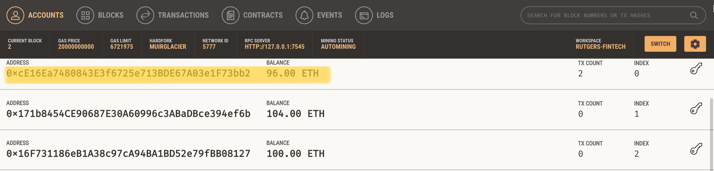

## Unit 19 Homework: Cryptocurrency Wallet

### Background
In this Challenge, I completed the code that enables customers to send cryptocurrency payments to fintech professionals.

### Files
[Starter-Code/fintech_finder.py](Starter-Code/fintech_finder.py) :  
The first file is called `fintech_finder.py`. It contains the code associated with the web interface

[Starter-Code/crypto_wallet.py](Starter-Code/crypto_wallet.py) :  
The second file is called `crypto_wallet.py`. This file contains the Ethereum transaction functions. 

I integrated the `crypto_wallet.py` Python script into the Fintech Finder interface program that is found in the `fintech_finder.py` file. This allows automation of the tasks associated with generating a digital wallet, accessing Ethereum account balances, and signing and sending transactions via a personal Ethereum blockchain called Ganache.

### Results:

Balance before:  

Transaction:  

Balance after:  

